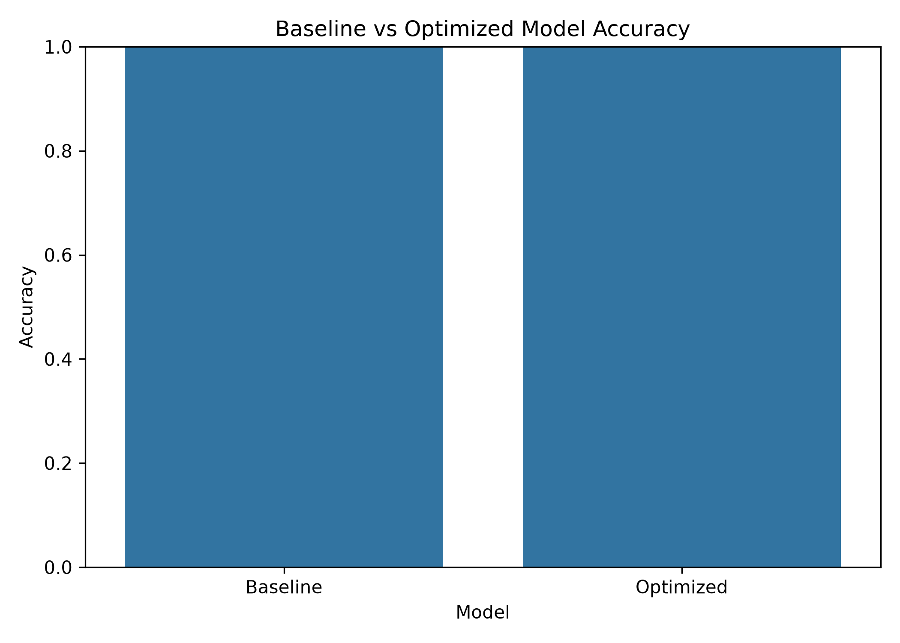
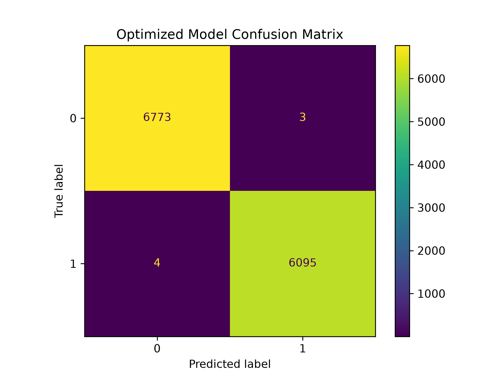
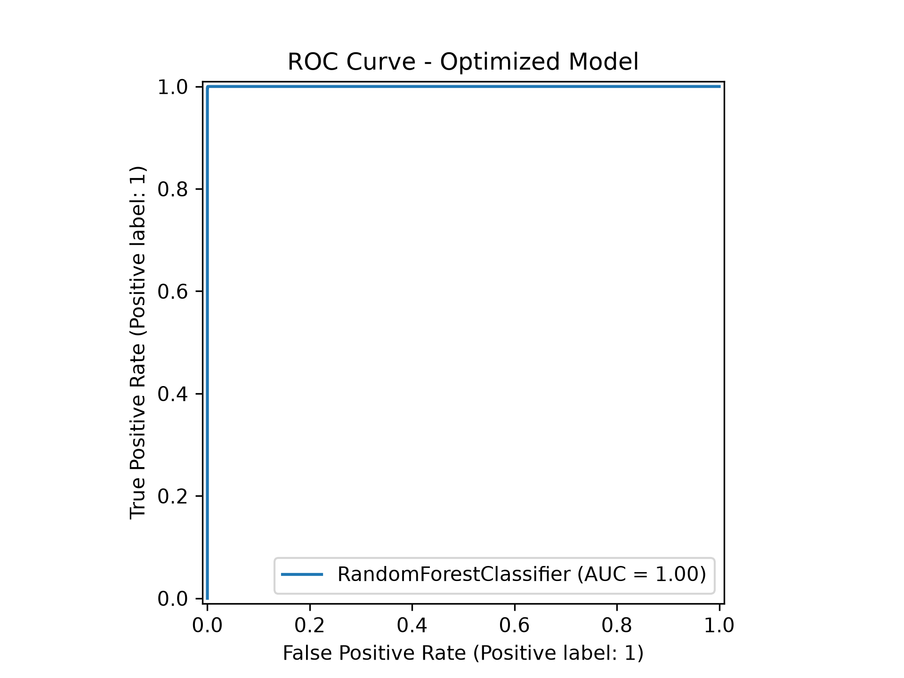
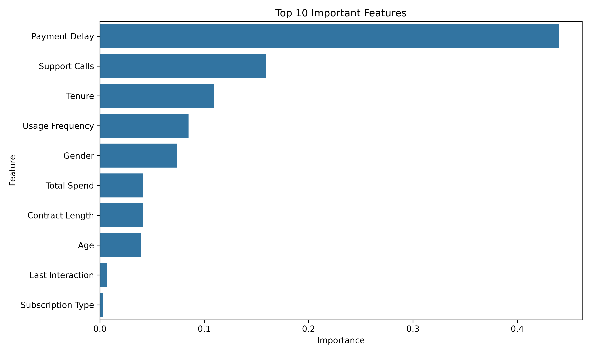

# 📊 Customer Churn Prediction using Model Optimization

**Name:** Krish J
**MUID:** Krish@mulearn

---

## 📌 Project Overview

Customer churn prediction is an essential business problem that helps organizations identify customers who are likely to discontinue their services. This project revisits the Customer Churn Prediction problem by building a baseline machine learning model and improving its performance through hyperparameter optimization.

The optimized model is compared with the baseline model to evaluate performance improvements and identify the key factors influencing customer churn.

---

## 🎯 Objectives

* Build a baseline machine learning classification model.
* Optimize the model using hyperparameter tuning.
* Compare the baseline and optimized models.
* Analyze the important features influencing customer churn.
* Provide business recommendations based on the model's findings.

---

## 📂 Dataset

**Dataset:** Customer Churn Dataset

The dataset contains customer demographic information, subscription details, service usage statistics, and customer behavior attributes used to predict whether a customer will churn.

---

## 🛠️ Technologies Used

* Python
* Pandas
* NumPy
* Matplotlib
* Seaborn
* Scikit-learn
* Jupyter Notebook

---

# 🤖 Model Building

## Baseline Model

A **Random Forest Classifier** with default parameters was trained as the baseline model.

## Optimization Technique

The baseline model was optimized using **GridSearchCV** by tuning the following hyperparameters:

* Number of Estimators (`n_estimators`)
* Maximum Depth (`max_depth`)
* Minimum Samples Split (`min_samples_split`)
* Minimum Samples Leaf (`min_samples_leaf`)

The best hyperparameter combination obtained from GridSearchCV was used to train the final optimized model.

---

# 📊 Model Performance Comparison

| Model           |  Accuracy  |
| :-------------- | :--------: |
| Baseline Model  | **99.79%** |
| Optimized Model | **99.80%** |

---

# 📈 Visualizations

## Baseline vs Optimized Model Comparison



---

## Confusion Matrix



---

## ROC Curve



---

## Feature Importance



---

# 🔍 Key Findings

* Hyperparameter tuning slightly improved the model accuracy from **99.79%** to **99.80%**.
* The optimized Random Forest model provided more reliable predictions than the baseline model.
* Feature importance analysis identified the most influential variables affecting customer churn.
* Customer behavior and subscription-related attributes play a significant role in predicting churn.
* The optimized model can effectively identify customers at risk of leaving.

---

# 💼 Business Recommendations

* Identify high-risk customers early using predictive analytics.
* Offer personalized retention campaigns and loyalty rewards.
* Encourage customers to opt for long-term subscription plans.
* Improve customer engagement through targeted communication.
* Continuously monitor important customer behavior metrics to reduce churn.

---

# ✅ Conclusion

This project demonstrates how machine learning model optimization can improve customer churn prediction. By applying **GridSearchCV** for hyperparameter tuning, the optimized Random Forest model achieved slightly better performance than the baseline model.

The feature importance analysis provides valuable business insights that can help organizations develop effective customer retention strategies and minimize customer churn.

---

# 📁 Project Structure

```text
Customer-Churn-Model-Optimization/
│
├── model_optimization.ipynb
├── README.md
│
└── images/
    ├── baseline_vs_optimized.png
    ├── confusion_matrix.png
    ├── roc_curve.png
    └── feature_importance.png
```
